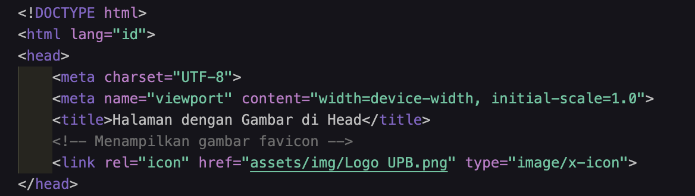

Penjelasan dari masing masing yang sudah di buat :
1. Ini Adalah Penjelasan dari Codingan Yang Sudah Saya Buat.

```html
<!DOCTYPE html>
<html lang="id">
```
- `<!DOCTYPE html>`: Deklarasi doctype ini memberitahu browser bahwa dokumen ini menggunakan HTML5.
- `<html lang="id">`: Tag `<html>` adalah elemen root dari dokumen HTML. Atribut `lang="id"` menunjukkan bahwa bahasa utama dari dokumen ini adalah bahasa Indonesia (`id` adalah kode ISO untuk bahasa Indonesia).

```html
<head>
    <meta charset="UTF-8">
    <meta name="viewport" content="width=device-width, initial-scale=1.0">
    <title>Halaman dengan Gambar di Head</title>
```
- `<head>`: Bagian ini berisi metadata, seperti informasi tentang dokumen HTML yang tidak terlihat langsung oleh pengguna, tetapi penting untuk pengaturan dan rendering halaman.
- `<meta charset="UTF-8">`: Tag ini menentukan karakter encoding yang digunakan oleh dokumen. `UTF-8` adalah format encoding yang dapat mewakili hampir semua karakter dari berbagai bahasa, termasuk simbol dan huruf.
- `<meta name="viewport" content="width=device-width, initial-scale=1.0">`: Tag ini mengatur cara tampilan halaman pada perangkat yang berbeda. Atribut ini penting untuk membuat halaman responsif, terutama pada perangkat mobile. `width=device-width` berarti lebar viewport akan sesuai dengan lebar layar perangkat. `initial-scale=1.0` berarti halaman akan dimuat pada skala 100%.
- `<title>Halaman dengan Gambar di Head</title>`: Tag ini menentukan judul halaman web yang akan ditampilkan pada tab browser atau ketika halaman disimpan sebagai bookmark.

```html
<!-- Menampilkan gambar favicon -->
<link rel="icon" href="assets/img/Logo UPB.png" type="image/x-icon">
```
- `<!-- Menampilkan gambar favicon -->`: Komentar HTML, yang memberikan penjelasan untuk pengembang. Komentar tidak akan ditampilkan di halaman web.
- `<link rel="icon" href="assets/img/Logo UPB.png" type="image/x-icon">`: Tag ini digunakan untuk menambahkan ikon di tab browser (favicon). 
  - `rel="icon"`: Menyatakan bahwa tautan ini adalah favicon.
  - `href="assets/img/Logo UPB.png"`: Lokasi file gambar untuk favicon, yang berada di dalam folder `assets/img/`.
  - `type="image/x-icon"`: Menyatakan bahwa tipe file gambar yang digunakan adalah ikon. Meskipun gambar berformat `.png`, browser masih dapat memprosesnya sebagai ikon.

---



2. Ini Adalah Penjelasan Dari Kode Selanjutnya Sesudah Header :

```html
<body>
```
- Tag `<body>`: Menandai awal dari isi dokumen HTML yang akan terlihat oleh pengguna di browser. Semua konten yang muncul di halaman web diletakkan di antara tag pembuka dan penutup `<body>`.

### 1. **Link Navigasi (`<nav>`)**

```html
<!-- menambahkan link navigasi -->
<nav>
    <a href="index.html">Home</a>
    <a href="about.html">About</a>
    <a href="http://www.google.com">Masuk Kehalaman Google</a>
</nav>
```
- **`<nav>`**: Tag ini digunakan untuk mendefinisikan bagian navigasi pada halaman web. Ini biasanya berisi tautan ke halaman-halaman penting dalam situs.
- **`<a href="...">`**: Tag `<a>` digunakan untuk membuat hyperlink. Atribut `href` menunjukkan lokasi yang dituju saat tautan diklik.
  - `href="index.html"`: Tautan ke halaman `index.html` di dalam direktori.
  - `href="about.html"`: Tautan ke halaman `about.html`.
  - `href="http://www.google.com"`: Tautan eksternal yang mengarah ke Google.

### 2. **Pemecah Halaman Horizontal (`<hr>`)**

```html
<hr>
```
- **`<hr>`**: Tag ini digunakan untuk membuat garis horizontal yang berfungsi sebagai pemisah visual antara bagian-bagian halaman.

### 3. **Judul Besar (`<h1>`)**

```html
<h1 class="">Selamat datang di Halaman Website saya !</h1>
```
- **`<h1>`**: Tag ini mendefinisikan heading terbesar dalam halaman web, biasanya digunakan untuk judul utama. Dalam hal ini, teks "Selamat datang di Halaman Website saya!" ditampilkan sebagai judul.
- **`class=""`**: Atribut `class` di sini kosong, yang berarti tidak ada gaya CSS yang diterapkan secara langsung. Namun, atribut ini biasanya digunakan untuk styling melalui CSS.

### 4. **Paragraf Pertama dan Kedua**

```html
<!-- Ini adalah paragraf pertama -->
<p>Kami sedang belajar HTML dasar, pada matakuliah Pemrograman Web di Prodi Teknik Informatika Universitas Pelita Bangsa. Pelajaran pertama yang kami dapat adalah membuat tampilan web sederhana dalam rangka mengenal tag-tag dasar HTML.</p>

<!-- Ini adalah paragraf kedua -->
<p>Ini merupakan sebuah paragraf yang terdiri dari beberapa kalimat yang saling mendukung sehingga menjadi satu kesatuan. Paragraf dibuat dengan menggunakan tag dasar html.</p>
```
- **`<p>`**: Tag `<p>` digunakan untuk mendefinisikan paragraf. Ini adalah blok teks dengan jarak vertikal di antara paragraf lainnya. Dua paragraf di atas berisi deskripsi tentang belajar HTML dasar di mata kuliah Pemrograman Web.

### 5. **Daftar Tidak Berurut (Unordered List)**

```html
<ul>
    <li>
        <b>Codingan Ini hanya di Tambahkan ( align=”center” ) pada tag p</b>
    </li>
</ul>
```
- **`<ul>`**: Tag ini digunakan untuk membuat daftar yang tidak berurut (unordered list), dengan titik-titik sebagai penanda (bullet points).
- **`<li>`**: Tag `<li>` mendefinisikan item dalam daftar. Setiap item dalam daftar diletakkan di antara tag `<li>`.
- **`<b>`**: Tag `<b>` membuat teks menjadi tebal (bold). Di sini, teks "Codingan Ini hanya di Tambahkan ( align=”center” ) pada tag p" akan ditampilkan dalam format tebal.

### 6. **Paragraf yang Ditetapkan Aligmentnya**

```html
<!-- Ini adalah paragraf pertama -->
<p align="center">( Center ) Kami sedang belajar HTML dasar, pada matakuliah Pemrograman Web di Prodi Teknik Informatika Universitas Pelita Bangsa. Pelajaran pertama yang kami dapat adalah membuat tampilan web sederhana dalam rangka mengenal tag-tag dasar HTML.</p>

<!-- Ini adalah paragraf kedua -->
<p align="right">( Right ) Ini merupakan sebuah paragraf yang terdiri dari beberapa kalimat yang saling mendukung sehingga menjadi satu kesatuan. Paragraf dibuat dengan menggunakan tag dasar html.</p>
```
- **`align="center"`**: Atribut `align` digunakan untuk mengatur perataan teks. Di sini, teks dalam paragraf pertama akan diratakan ke tengah.
- **`align="right"`**: Teks dalam paragraf kedua akan diratakan ke kanan.

### 7. **Menambahkan Gambar**

```html
<ul>
    <li>
        <b>Menambahkan Gaambar</b>
    </li>
</ul>

```
- **``**: Tag `` digunakan untuk menampilkan gambar pada halaman web. Atribut-atribut yang digunakan dalam tag ini meliputi:
  - **`src="assets/img/Logo UPB.png"`**: Atribut `src` (source) mendefinisikan path atau lokasi file gambar. Di sini, gambar yang ditampilkan adalah file `Logo UPB.png` yang terletak di folder `assets/img/`.
  - **`title="Logo Universitas Pelita Bangsa"`**: Atribut `title` memberikan teks yang muncul saat kursor diarahkan ke gambar.
  - **`width="200"`**: Atribut ini menetapkan lebar gambar menjadi 200 piksel.

### Penutup

```html
</body>
</html>
```
- **`</body>`**: Menandakan akhir dari isi dokumen HTML yang terlihat oleh pengguna.
- **`</html>`**: Menandakan akhir dari seluruh dokumen HTML.

---


---

Jawab Pertanyaan Berikut :
1. Lakukan perubahan pada kode sesuai dengan keinginan Anda, amati apakah ada error ketika terjadi kesalahan penulisan tag.
2. Apa perbedaan dari tag `<p>` dengan tag `<br>`? Berikan penjelasannya.
3. Apa perbedaan atribut `title` dan `alt` pada tag ``? Berikan penjelasannya.
4. Untuk mengatur ukuran gambar, digunakan atribut `width` dan `height`. Agar tampilan gambar proporsional, sebaiknya kedua atribut tersebut diisi semua atau tidak? Berikan penjelasannya.
5. Pada link, tambahkan atribut `target` dengan nilai atribut bervariasi (`_blank`, `_self`, `_top`, `_parent`). Apa yang terjadi pada masing-masing nilai atribut tersebut?

Jawaban Dari Pertanyaan:
1. Lakukan perubahan pada kode sesuai dengan keinginan Anda, amati apakah ada error ketika terjadi kesalahan penulisan tag.
    - Jawaban: Ketika terjadi kesalahan penulisan tag, browser tidak akan dapat memproses tag tersebut dengan benar, yang dapat menyebabkan tampilan halaman web menjadi tidak sesuai dengan yang diharapkan. Misalnya, jika tag `<p>` ditulis sebagai `<(p)>`, browser tidak akan mengenali tag tersebut sebagai paragraf dan teks tidak akan diformat sebagai paragraf.

2. Apa perbedaan dari tag `<p>` dengan tag `<br>`? Berikan penjelasannya.
    - Jawaban: Tag `<p>` digunakan untuk membuat paragraf baru dan secara otomatis menambahkan spasi di atas dan di bawah paragraf. Sedangkan tag `<br>` digunakan untuk membuat baris baru tanpa menambahkan spasi tambahan. Tag `<br>` biasanya digunakan untuk memecah baris teks dalam paragraf atau elemen lain tanpa memulai paragraf baru.

3. Apa perbedaan atribut `title` dan `alt` pada tag ``? Berikan penjelasannya.
    - Jawaban: Atribut `title` pada tag `` digunakan untuk memberikan informasi tambahan yang akan ditampilkan sebagai tooltip ketika pengguna mengarahkan kursor ke gambar. Sedangkan atribut `alt` digunakan untuk memberikan teks alternatif yang akan ditampilkan jika gambar tidak dapat dimuat. Atribut `alt` juga penting untuk aksesibilitas, karena pembaca layar akan membacakan teks alternatif ini untuk pengguna dengan gangguan penglihatan.

4. Untuk mengatur ukuran gambar, digunakan atribut `width` dan `height`. Agar tampilan gambar proporsional, sebaiknya kedua atribut tersebut diisi semua atau tidak? Berikan penjelasannya.
    - Jawaban: Agar tampilan gambar tetap proporsional, sebaiknya hanya salah satu dari atribut `width` atau `height` yang diisi. Jika kedua atribut diisi, gambar mungkin akan terdistorsi jika rasio aspek asli gambar tidak sesuai dengan nilai yang diberikan. Dengan mengisi hanya satu atribut, browser akan secara otomatis menyesuaikan atribut lainnya untuk mempertahankan rasio aspek asli gambar.

5. Pada link, tambahkan atribut `target` dengan nilai atribut bervariasi (`_blank`, `_self`, `_top`, `_parent`). Apa yang terjadi pada masing-masing nilai atribut tersebut?
    - Jawaban:
      - `_blank`: Membuka link di tab atau jendela baru.
      - `_self`: Membuka link di tab atau jendela yang sama (default).
      - `_top`: Membuka link di seluruh jendela browser, menggantikan semua frame.
      - `_parent`: Membuka link di frame induk dari frame saat ini, atau di tab/jendela yang sama jika tidak ada frame induk.
